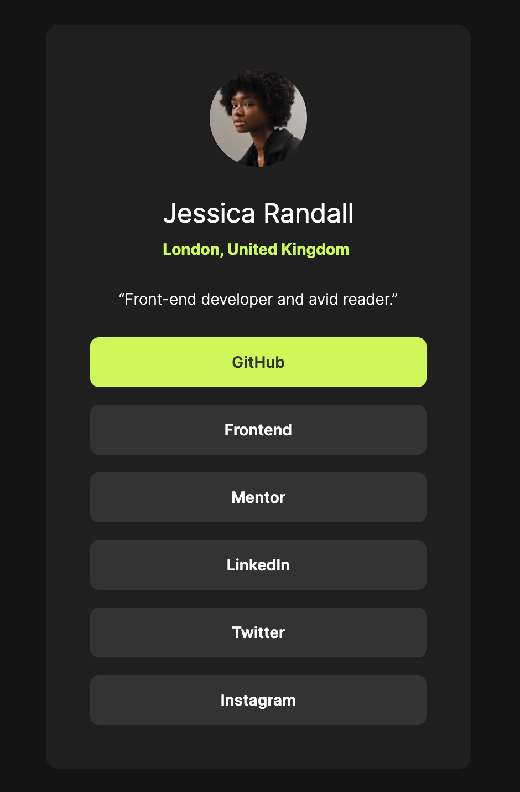

# Frontend Mentor - Social links profile solution

This is a solution to the [Social links profile challenge on Frontend Mentor](https://www.frontendmentor.io/challenges/social-links-profile-UG32l9m6dQ). Frontend Mentor challenges help you improve your coding skills by building realistic projects. 

## Table of contents

- [Frontend Mentor - Social links profile solution](#frontend-mentor---social-links-profile-solution)
  - [Table of contents](#table-of-contents)
  - [Overview](#overview)
    - [The challenge](#the-challenge)
    - [Screenshot](#screenshot)
  - [My process](#my-process)
    - [Built with](#built-with)
    - [What I learned](#what-i-learned)
    - [Useful resources](#useful-resources)

## Overview

### The challenge

Users should be able to:

- See hover and focus states for all interactive elements on the page

### Screenshot



## My process

### Built with

- Semantic HTML5 markup
- CSS custom properties
- Flexbox

### What I learned

Prefer unitless numbers for `line-hight` over percentages.

The inline quotation `<q>` element surrounds the text in quotation marks.

Set `font-size` on `html` if you use `rem`.

The way I can set a container element wider than its child elements widths but also able to shrink:
`initial`: Flex item doesn't grow but can shrink. This default value expands to `flex: 0 1 auto`. The item is sized according to its `width` or `height` properties, depending on the flex-direction.

```css
.some-class {
  flex: initial;
  width: 384px;
}
```

Add bottom margin to all of the list items but the last:
```css
li:not(:last-child) {
  margin-bottom: var(--spacing-200);
}
```

How to import a font file:
```css
@font-face {
  font-family: "Inter";
  src: url("./assets/fonts/Inter-VariableFont_slnt,wght.ttf") format("truetype");
  font-weight: 200 700;
  font-style: normal;
}
```

### Useful resources

- [flex - MDN](https://developer.mozilla.org/en-US/docs/Web/CSS/flex) - Explains how `flex` property works.

- [line-hight - MDN](https://developer.mozilla.org/en-US/docs/Web/CSS/line-height#prefer_unitless_numbers_for_line-height_values) - This example shows why it is better to use `number` values instead of `length` values.